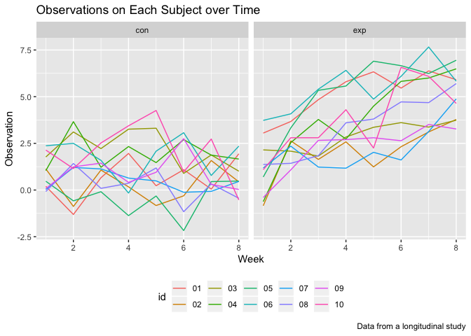
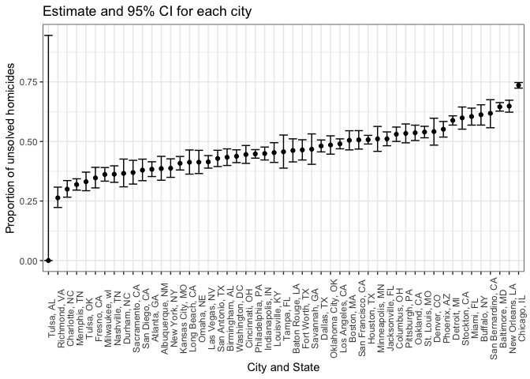

Hw5
================
Jingwei Ren
11/7/2018

### problem 1

Create a tidy dataframe containing data from all participants, including the subject ID, arm, and observations over time:

Start with a dataframe containing all file names; the list.files function will help

Iterate over file names and read in data for each subject using purrr::map and saving the result as a new variable in the dataframe

Tidy the result; manipulate file names to include control arm and subject ID, make sure weekly observations are “tidy”, and do any other tidying that’s necessary

``` r
data = 
  tibble(file_name = list.files(path = './data')) %>% 
  mutate(name = map(.x = str_c("./data/", file_name),~read.csv(.x))) 

data = data %>%
  unnest() %>% 
  separate(file_name, into = c("arm", "id"), sep = "_",remove = F) %>% 
  gather(key = week, value = observation, week_1:week_8) %>% 
  separate(week, into = c("rm", "week"), sep = "_") %>%
  separate(id, into = c("id", "csv"), sep = ".csv") %>%
  select(-csv, -rm)
```

Make a spaghetti plot showing observations on each subject over time, and comment on differences between groups.

``` r
data %>% 
   mutate(week = as.numeric(week))%>%
  ggplot(aes(x = week, y = observation,color = id))+
  geom_line() +
  facet_grid(~arm)+
  labs(
    title = "Observations on Each Subject over Time",
    x = "Week",
    y = "Observation",
    caption = "Data from a longitudinal study") +
  theme(legend.position = "bottom")
```



The result showed that weekly observations for control arm were relatively stable through out the entire eight weeks. However, for experimental arm, obersations increase through out the eight weeks, approximately increasing by 5.

### problem 2

Describe the raw data.

``` r
homicide_data = read_csv("./data2/homicide-data.csv") 
```

    ## Parsed with column specification:
    ## cols(
    ##   uid = col_character(),
    ##   reported_date = col_integer(),
    ##   victim_last = col_character(),
    ##   victim_first = col_character(),
    ##   victim_race = col_character(),
    ##   victim_age = col_character(),
    ##   victim_sex = col_character(),
    ##   city = col_character(),
    ##   state = col_character(),
    ##   lat = col_double(),
    ##   lon = col_double(),
    ##   disposition = col_character()
    ## )

The raw dataset has 52179 rows and 12 columns. Variables include reported date, each victim's information ,included id, names, race, age and sex, and the location of the killing, included city, state, longitude and latitude and finally whether an arrest was made.

Create a city\_state variable (e.g. “Baltimore, MD”) and then summarize within cities to obtain the total number of homicides and the number of unsolved homicides (those for which the disposition is “Closed without arrest” or “Open/No arrest”).

``` r
homicide = 
  homicide_data%>%
  mutate(city_state = str_c(city, ", ", state)) %>%
  group_by(city_state, disposition) %>%
  summarise(number= n()) %>%
  spread(key = disposition, value = number) %>%
  janitor::clean_names() %>%
  mutate(total_homicides = rowSums(cbind(closed_by_arrest, closed_without_arrest, open_no_arrest), na.rm = T), unsolve_homicides = rowSums(cbind(closed_without_arrest, open_no_arrest), na.rm = T)) %>%
  select(- closed_by_arrest, - closed_without_arrest, -open_no_arrest)

head(homicide)
```

    ## # A tibble: 6 x 3
    ## # Groups:   city_state [6]
    ##   city_state      total_homicides unsolve_homicides
    ##   <chr>                     <dbl>             <dbl>
    ## 1 Albuquerque, NM             378               146
    ## 2 Atlanta, GA                 973               373
    ## 3 Baltimore, MD              2827              1825
    ## 4 Baton Rouge, LA             424               196
    ## 5 Birmingham, AL              800               347
    ## 6 Boston, MA                  614               310

For the city of Baltimore, MD, use the prop.test function to estimate the proportion of homicides that are unsolved; save the output of prop.test as an R object, apply the broom::tidy to this object and pull the estimated proportion and confidence intervals from the resulting tidy dataframe.

``` r
baltimore = 
  homicide %>%
  filter(city_state == "Baltimore, MD")

 proptest = prop.test(baltimore$unsolve_homicides, baltimore$total_homicides)
 
 proptest %>% 
  broom::tidy() %>% 
  select(estimate, conf.low, conf.high)
```

    ## # A tibble: 1 x 3
    ##   estimate conf.low conf.high
    ##      <dbl>    <dbl>     <dbl>
    ## 1    0.646    0.628     0.663

The estimated proprotion for Baltimore is 64.6 % with the confidence interval (0.628,0.663)

Now run prop.test for each of the cities in your dataset, and extract both the proportion of unsolved homicides and the confidence interval for each. Do this within a “tidy” pipeline, making use of purrr::map, purrr::map2, list columns and unnest as necessary to create a tidy dataframe with estimated proportions and CIs for each city.

``` r
prop_zip = function(x,y){
  
  prop.test(x,y) %>%
    broom::tidy()
}

city_prop =
  ungroup(homicide) %>%
  mutate(prop_test = map2(homicide$unsolve_homicides, homicide$total_homicides, prop_zip))%>%
  unnest() %>%
  select(city_state, estimate,conf.low, conf.high)
```

    ## Warning in prop.test(x, y): Chi-squared approximation may be incorrect

``` r
head(city_prop)
```

    ## # A tibble: 6 x 4
    ##   city_state      estimate conf.low conf.high
    ##   <chr>              <dbl>    <dbl>     <dbl>
    ## 1 Albuquerque, NM    0.386    0.337     0.438
    ## 2 Atlanta, GA        0.383    0.353     0.415
    ## 3 Baltimore, MD      0.646    0.628     0.663
    ## 4 Baton Rouge, LA    0.462    0.414     0.511
    ## 5 Birmingham, AL     0.434    0.399     0.469
    ## 6 Boston, MA         0.505    0.465     0.545

Create a plot that shows the estimates and CIs for each city – check out geom\_errorbar for a way to add error bars based on the upper and lower limits. Organize cities according to the proportion of unsolved homicides.

``` r
city_prop  %>%
mutate(city_state = forcats::fct_reorder(city_state, estimate)) %>% 
ggplot(aes(x = city_state, y = estimate)) +
geom_point() +
  geom_errorbar(aes(ymin = conf.low, ymax = conf.high)) +
  theme_bw() +
   labs(title = "Estimate and 95% CI for each city", 
         x = "City and State", 
         y = "Proportion of unsolved homicides") +
  theme( axis.text.x = element_text(angle = 90))
```


